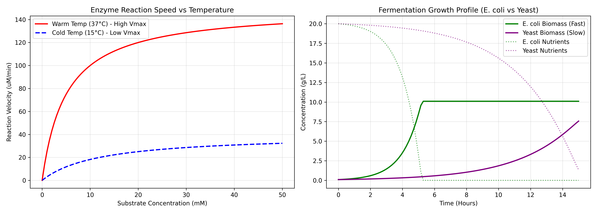

# In-Silico Enzyme & Fermentation Kinetics Simulator


An open-source computational biology tool written in Python to model enzyme kinetics (**Michaelis-Menten Model**) and batch microbial growth dynamics (**Monod Kinetic Model**). This simulator allows researchers, students, and bioprocess engineers to run *in-silico* parameter variations, comparing organism doubling speeds (*E. coli* vs. Baker's Yeast) and environmental impacts (temperature modulation).

---

## 📌 Project Overview

Running wet-lab bioprocess experiments or benchtop fermentations incurs significant costs in time, media, and enzyme reagents. This simulator uses numerical Ordinary Differential Equation (ODE) integration to model:
1. **Enzyme Saturation Kinetics:** Reaction velocity ($v$) scaling under varying thermal/substrate conditions.
2. **Batch Fermentation Profiles:** Biomass growth ($\Delta X$) coupled with nutrient depletion ($\Delta S$) over time.

---

## 🧬 Biological & Mathematical Foundations

### 1. Michaelis-Menten Kinetics
Models the conversion rate of a substrate ($S$) into product via an enzyme:

$$v = \frac{V_{\max} \cdot [S]}{K_m + [S]}$$

* **$v$**: Reaction velocity ($\mu\text{mol/min}$)
* **$V_{\max}$**: Maximum reaction velocity at full substrate saturation
* **$K_m$**: Michaelis constant (substrate concentration at $\frac{1}{2} V_{\max}$)

### 2. Monod Cell Growth Model
Describes the specific growth rate ($\mu$) of a cell population constrained by a limiting nutrient:

$$\mu = \mu_{\max} \cdot \frac{S}{K_s + S}$$

* **$\mu_{\max}$**: Maximum specific growth rate ($\text{hr}^{-1}$)
* **$K_s$**: Half-velocity constant ($\text{g/L}$)
* **$S$**: Substrate concentration ($\text{g/L}$)

### 3. Differential Equations for Batch Fermentation
Calculated dynamically across time using Runge-Kutta numerical integration (`scipy.integrate.solve_ivp`):

* **Biomass Accumulation:** $\frac{dX}{dt} = \mu \cdot X$
* **Nutrient Depletion:** $\frac{dS}{dt} = -\frac{1}{Y_{x/s}} \cdot \mu \cdot X$

*(where $Y_{x/s}$ is the cell mass yield coefficient per gram of substrate consumed)*

---

## 📊 Visual Results



---

## 🗂️ Project Structure

```text
enzyme-fermentation-simulator/
├── app.py                      # Main simulation runner & plotting script
├── biotech_comparison_plots.png # Generated simulation output figure
├── requirements.txt            # Required Python dependencies
└── README.md                   # Project documentation